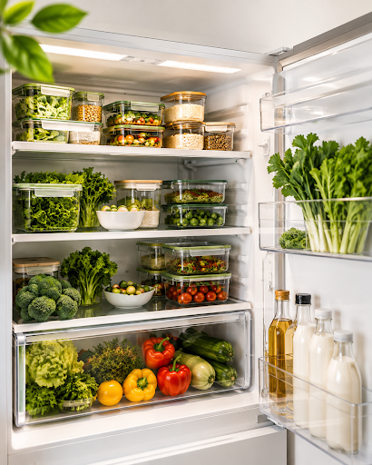
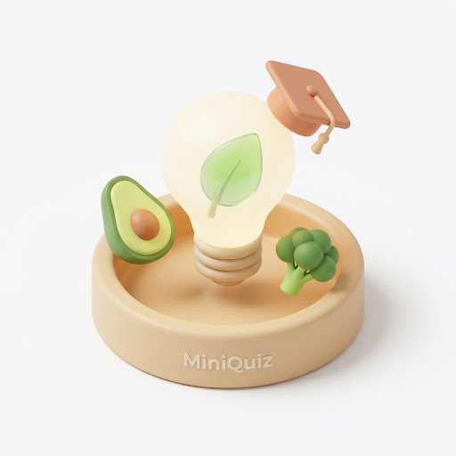
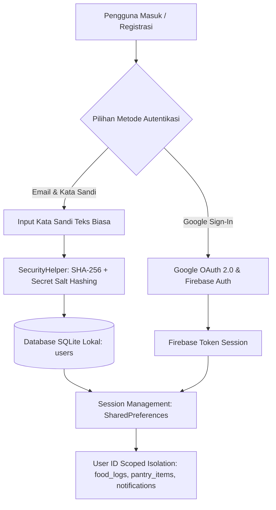

<div align="center">


# FoodCura
### *Smart Nutrition Tracker & Food Waste Reducer*

[](https://flutter.dev)
[](https://dart.dev)
[](https://firebase.google.com)
[](https://sqlite.org)
[](https://ai.google.dev)
[](pubspec.yaml)
[](test/)
[](LICENSE)
[](#-kontribusi--pedoman-pengembangan)

<p align="center">
  <b>Aplikasi Mobile Cerdas Berbasis Flutter untuk Pelacak Nutrisi Harian, Manajemen Bahan Dapur (Zero Food Waste), dan Asisten AI Google Gemini.</b>
</p>

[Tampilan Aplikasi](#-tampilan-antarmuka-aplikasi-ui-showcase) • [Tentang](#-tentang-foodcura) • [Fitur Utama](#-fitur-utama-aplikasi) • [Teknologi](#-teknologi--dependensi) • [Keamanan](#-keamanan--autentikasi-berlapis) • [Arsitektur](#-arsitektur-proyek-mvc-pattern) • [Integrasi AI](#-integrasi-fitur-google-gemini-ai) • [Panduan Instalasi](#-cara-menjalankan-aplikasi) • [Testing](#-validasi-kualitas-kode--testing) • [Kontribusi](#-kontribusi--pedoman-pengembangan) • [Changelog](#-changelog) • [Lisensi & Privasi](#-lisensi--kebijakan-privasi)

</div>

---

## 📱 Tampilan Antarmuka Aplikasi (UI Showcase)

Berikut adalah ringkasan visual alur dan antarmuka utama pada aplikasi **FoodCura**:

| 🚀 Onboarding & Panduan | 🥗 Pelacak Nutrisi & Makanan | 📦 Smart Pantry & Expiry Tracker |
| :---: | :---: | :---: |
| <br><sub><b>Edukasi Gizi Seimbang</b></sub> | <br><sub><b>Pencatatan Nutrisi TKPI</b></sub> | <br><sub><b>Manajemen Dapur & Expiry</b></sub> |

| 🔐 Keamanan & Autentikasi | 🤖 AI Asisten & Mini Quiz | 👤 Profil & Pusat Bantuan |
| :---: | :---: | :---: |
| <br><sub><b>OAuth 2.0 & SHA-256 + Salt</b></sub> | <br><sub><b>Gemini AI Structured Quiz</b></sub> | <br><sub><b>Bento Stats & FAQ Bantuan</b></sub> |

---

## 📖 Tentang FoodCura

**FoodCura** hadir sebagai solusi komprehensif untuk dua tantangan utama gaya hidup modern: **menjaga pola makan bergizi seimbang** dan **mencegah pemborosan bahan makanan rumah tangga (*Zero Food Waste*)**.

Dengan mengintegrasikan tabel komposisi pangan Indonesia (TKPI), pelacak masa kedaluwarsa bahan dapur (*Pantry Expiry Tracker*), sistem reward edukatif *Eco Points*, serta kecerdasan buatan **Google Gemini AI**, FoodCura mendampingi pengguna hidup lebih sehat sekaligus melestarikan lingkungan dan menghemat pengeluaran belanja pangan harian.

---

## ✨ Fitur Utama Aplikasi

### 1. 🏠 Smart Daily Dashboard
* **Ringkasan Nutrisi Harian**: Visualisasi interaktif asupan kalori (target harian 2.000 kkal) dan 4 pilar makronutrisi (*Protein, Karbohidrat, Lemak maks 67g, Kolesterol maks 300mg*).
* **AI Daily Nutrition Coach**: Rekomendasi menu makan sehat berikutnya dan evaluasi gizi secara real-time bertenaga Gemini AI.
* **Status Pantry Urgent**: Indikator *live badge* untuk bahan makanan yang mendekati kedaluwarsa (≤2 hari).
* **Pelacak Streak & Eco Points**: Menghitung konsistensi hari aktif mencatat makanan dan total poin apresiasi dari kuis edukasi.

### 2. 🥗 Nutrition & Meal Tracker
* **Pencatatan Makanan Terstruktur**: Log makanan berdasarkan 4 waktu makan (*Sarapan, Makan Siang, Makan Malam, Camilan*).
* **Katalog Makanan Indonesia**: Database nutrisi lokal lengkap (TKPI) dengan rincian kalori, makronutrisi, foto ilustrasi, dan takaran porsi.
* **Navigasi Riwayat Kalender**: Fleksibilitas memilih tanggal (*Hari Ini, Kemarin, Besok, atau tanggal lampau*) untuk memantau tren gizi harian.
* **Detail & Catatan Personal**: Modal interaktif untuk memeriksa komposisi gizi, menambahkan catatan khusus, atau menghapus log.

### 3. 📦 Smart Pantry & Expiry Tracker (*Zero Food Waste*)
* **Manajemen Stok Dapur**: Inventarisasi bahan mentah dan kemasan berdasarkan lokasi penyimpanan (*Kulkas, Freezer, Lemari Kering*).
* **Indikator Urgensi Berbasis Warna**:
  * 🔴 **Urgent / Expired**: Kedaluwarsa dalam ≤2 hari atau sudah lewat batas.
  * 🟡 **Segera**: Kedaluwarsa dalam 3–5 hari.
  * 🟢 **Aman**: Kedaluwarsa dalam >5 hari.
* **Tandai Habis (*Mark as Used*)**: Mengubah status bahan yang telah dimasak/digunakan untuk menjaga akurasi inventaris dapur.

### 4. 🤖 Asisten Cerdas Google Gemini AI
* **AI Daily Nutrition Coach**: Analisis otomatis asupan harian dengan rekomendasi menu sehat berikutnya yang dipersonalisasi.
* **AI Interactive Mini Quiz**: Generator 5 soal kuis pilihan ganda edukatif seputar gizi dan pencegahan *food waste* dengan mode JSON terstruktur (*Structured Output*), bobot panjang opsi seimbang, dan reward +10 Eco Points per jawaban benar.
* **Multi-Model Fallback Chain**: Rangkaian fallback model cerdas (`gemini-3.7-flash`, `gemini-3.6-flash`, `gemini-flash-latest`) serta *Curated Offline Pool* sehingga aplikasi tetap berfungsi normal tanpa koneksi internet.

### 5. 📚 Food Info & Edukasi Gizi
* **Artikel & Panduan Praktis**: Kumpulan artikel edukasi gizi seimbang, tips penyimpanan bahan makanan di kulkas, dan panduan *meal prep* hemat.
* **Pencarian Cepat & Kuis Interaktif**: Filter kategori artikel, live search bar, dan akses langsung ke AI Mini Quiz.

### 6. 👤 Profil Pengguna & Pusat Bantuan
* **Bento Stats Grid**: Statistik performa akun (*Total Eco Points, Streak Aktif, Unread Notifications*).
* **Avatar Dinamis Google Account-Style**: Avatar inisial dengan palet warna modern dinamis berbasis identitas pengguna.
* **Pusat Bantuan Interaktif**: FAQ terstruktur (Umum, Nutrisi, Food Waste, Akun & Keamanan), live search bar bantuan, dan kontak dukungan.
* **Manajemen Akun & Keamanan**: Edit profil, ganti kata sandi lokal, pengaturan preferensi notifikasi, dan fleksibilitas *Account Chooser* Google Sign-In.

### 7. 🔔 Smart Local Notifications
* **Pengingat Jadwal Makan**: Notifikasi terencana untuk waktu sarapan, makan siang, dan makan malam dengan zona waktu akurat.
* **Peringatan Kedaluwarsa Bahan**: Notifikasi otomatis untuk bahan dapur yang mendekati batas waktu simpan kritis.
* **Peringatan Batas Nutrisi AKG**: Notifikasi peringatan dini saat asupan harian melampaui batas aman (Lemak ≥67g, Kolesterol >300mg, Kalori >2000 kkal, Karbohidrat >300g, Protein >65g).

### 8. 🌐 Real-Time Connectivity, Caching & In-App Updates
* **Floating Connectivity Banner**: Indikator status jaringan real-time melayang (*Chrome-style floating pill*) yang memberitahu saat offline dan pulih kembali secara halus tanpa mengganggu navigasi.
* **Smart Image Caching & Skeleton Shimmer**: Pemuatan gambar foto makanan lokal & remote dengan disk cache otomatis serta animasi skeleton loader (*shimmer effect*).
* **In-App Update Engine**: Dukungan pemeriksaan versi pembaruan aplikasi langsung dari Google Play Store (*Flexible & Immediate updates*).
* **Cupertino Wheel Time Picker**: Pemilih waktu jadwal pengingat makan berbasis roda putar (*wheel picker sheet*) iOS yang responsif dan elegan.

---

## 🛠️ Teknologi & Dependensi

| Kategori | Teknologi / Paket | Versi | Kegunaan |
| :--- | :--- | :--- | :--- |
| **Framework & Bahasa** | [Flutter](https://flutter.dev) & [Dart](https://dart.dev) | SDK `^3.12.2` | Core mobile cross-platform framework |
| **Local Database** | [`sqflite`](https://pub.dev/packages/sqflite), [`path`](https://pub.dev/packages/path) | `^2.4.3` / `^1.9.0` | Database relasional lokal SQLite (Offline First) |
| **State Management** | `ChangeNotifier` & `Provider` pattern | Native | Reactive unidirectional data flow (MVC) |
| **Cloud & Autentikasi** | [`firebase_core`](https://pub.dev/packages/firebase_core), [`firebase_auth`](https://pub.dev/packages/firebase_auth) | `^3.12.0` / `^5.5.0` | Inisialisasi Firebase & manajemen akun cloud |
| **Google Sign-In** | [`google_sign_in`](https://pub.dev/packages/google_sign_in) | `^6.2.2` | Otentikasi OAuth 2.0 via Google Account |
| **Kriptografi & Keamanan** | [`crypto`](https://pub.dev/packages/crypto) | `^3.0.6` | Hashing SHA-256 + Salt pada kata sandi SQLite lokal |
| **Kecerdasan Buatan** | [Google Gemini REST API](https://ai.google.dev) | Multi-Model | Model generasi `>= 3.6` (`gemini-3.7-flash`, `gemini-3.6-flash`, `gemini-flash-latest`) |
| **Local Storage** | [`shared_preferences`](https://pub.dev/packages/shared_preferences) | `^2.3.4` | Penyimpanan sesi aktif dan user preferences |
| **Local Notifications** | [`flutter_local_notifications`](https://pub.dev/packages/flutter_local_notifications), [`timezone`](https://pub.dev/packages/timezone) | `^18.0.1` / `^0.10.1` | Pengingat jadwal makan, peringatan kedaluwarsa & nutrisi berbasis zona waktu |
| **Network & Connectivity** | [`connectivity_plus`](https://pub.dev/packages/connectivity_plus), [`http`](https://pub.dev/packages/http) | `^7.3.1` / `^1.2.0` | Pemantauan status jaringan real-time & REST API client |
| **Image & Media Cache** | [`cached_network_image`](https://pub.dev/packages/cached_network_image) | `^3.4.1` | Caching gambar lokal pada disk, error handling, dan optimasi memori |
| **UI, Vector & Animation** | [`flutter_svg`](https://pub.dev/packages/flutter_svg), [`shimmer`](https://pub.dev/packages/shimmer), [`flutter_animate`](https://pub.dev/packages/flutter_animate), `cupertino_icons` | `^2.0.9` / `^3.0.0` / `^4.5.2` / `^1.0.8` | Rendering SVG, animasi skeleton loading shimmer, dan micro-animations |
| **App Maintenance** | [`in_app_update`](https://pub.dev/packages/in_app_update) | `^5.0.0` | Pemeriksaan pembaruan aplikasi langsung via Google Play Store |
| **Formatting** | [`intl`](https://pub.dev/packages/intl) | `^0.19.0` | Format mata uang rupiah dan tanggal multibahasa |

---

## 🔒 Keamanan & Autentikasi Berlapis

FoodCura menerapkan arsitektur keamanan multi-layer untuk melindungi integritas akun pengguna:



| Lapisan Keamanan | Implementasi | Perlindungan |
| :--- | :--- | :--- |
| **Google Sign-In & Firebase Auth** | OAuth 2.0 via Google Play Services & Firebase Authentication | Kredensial tidak pernah disimpan di aplikasi; kebal dari *reverse engineering*; dilengkapi `disconnect()` saat logout untuk pemilihan akun fleksibel. |
| **Password Hashing Lokal** | **SHA-256 + Secret Salt** ([SecurityHelper](lib/utils/security_helper.dart)) | Password di SQLite disimpan dalam format *one-way cryptographic hash* 64 karakter hex, mencegah kebocoran data jika HP di-*root*. |
| **Auto-Migration Keamanan** | Backward Compatibility Engine ([DBHelper](lib/database/db_helper.dart)) | Akun lama yang belum di-hash secara otomatis di-upgrade ke hash SHA-256 saat berhasil login tanpa mengganggu kenyamanan pengguna. |
| **Data Isolation** | SQLite Scoped User ID (`userId`) | Setiap pengguna memiliki data terisolasi secara mandiri pada tabel `food_logs`, `pantry_items`, dan `notifications`. |

---

## 🏛️ Arsitektur Proyek (MVC Pattern)

Aplikasi dibangun menggunakan pola arsitektur **Model-View-Controller (MVC)** yang bersih, terisolasi, dan mudah dirawat:

```
lib/
├── constants/          # Design tokens & konstanta terpusat
│   ├── api_constants.dart         # Konfigurasi endpoint & konstanta API
│   ├── app_colors.dart            # Palet warna primer, netral, dan status
│   ├── app_constants.dart         # Nama database, timeout, dan pref keys
│   ├── app_date_formatter.dart    # Parser tanggal multibahasa (Indonesian locale)
│   ├── app_food_formatter.dart    # Formatter takaran porsi & pembulatan gizi
│   ├── app_images.dart            # Path aset gambar & logo
│   ├── app_theme.dart             # ThemeData terpadu
│   └── app_typography.dart        # Preset TextStyle Plus Jakarta Sans
├── controllers/        # Business Logic & State layer (ChangeNotifier)
│   ├── auth_controller.dart          # Alur login, register, reset password
│   ├── dashboard_controller.dart     # Ringkasan nutrisi harian & AI coach
│   ├── food_info_controller.dart     # Manajemen artikel & pencarian edukasi
│   ├── food_tracker_controller.dart  # Pencatatan makanan & agregasi kalori
│   ├── notification_controller.dart  # Filter & manipulasi status notifikasi
│   ├── pantry_controller.dart        # Inventaris dapur & status kedaluwarsa
│   ├── profile_controller.dart       # Edit profil, ganti password, data user
│   └── quiz_controller.dart          # Generator kuis interaktif & skor
├── database/           # SQLite DBHelper, schema DAO, & katalog lokal
│   ├── db_helper.dart                # Inisialisasi DB, migrasi, dan operasi CRUD
│   └── pantry_grocery_catalog.dart   # Katalog default bahan dapur
├── models/             # Pure Data models & entity definitions
│   ├── article_model.dart            # Model artikel edukasi gizi
│   ├── food_item_model.dart          # Model katalog makanan (TKPI)
│   ├── food_log_model.dart           # Model log konsumsi makanan harian
│   ├── help_faq_model.dart           # Model FAQ pusat bantuan
│   ├── notification_model.dart       # Model notifikasi lokal & scheduler
│   ├── onboarding_model.dart         # Model panduan onboarding
│   ├── pantry_ingredient_model.dart  # Model bahan mentah pantry
│   ├── pantry_item_model.dart        # Model item inventaris dapur & urgency
│   ├── quiz_model.dart               # Model soal kuis & opsi jawaban
│   └── user_model.dart               # Model entitas pengguna
├── services/           # External service integration & domain managers
│   ├── app_notifiers.dart         # Global Reactive Notifiers (Sync State antar-tab)
│   ├── app_update_service.dart    # In-App Update Engine Google Play Store
│   ├── auth_service.dart          # Firebase Auth & Google Sign-In
│   ├── connectivity_service.dart  # Real-time Network Connectivity Monitor
│   ├── gemini_service.dart        # Google Gemini AI Service & Fallback Chain
│   ├── notification_service.dart  # Local Push Notifications
│   ├── nutrition_service.dart     # Standar AKG & Nutrition Thresholds
│   ├── preference_handler.dart    # SharedPreferences Local Storage
│   ├── reminder_service.dart      # Meal Reminder Scheduler & Expiry Checker
│   └── streak_service.dart        # Dynamic Streak Calculation Engine
├── utils/              # Helper utilitas keamanan
│   └── security_helper.dart       # SHA-256 + Salt Password Hasher & Verifier
├── views/              # UI Presentation layer (Feature-Grouped & Modular)
│   ├── auth/           # LoginScreen, RegisterScreen, ForgotPasswordScreen
│   ├── dashboard/      # DashboardScreen & widgets (QuizModal)
│   ├── food_info/      # FoodInfoScreen & widgets (ArticleDetailModal, DailyTipCard, FeaturedCard, QuizCard)
│   ├── food_tracker/   # FoodTrackerScreen & widgets (AddFoodModal, AllCatalogModal, FoodDetailModal, SummaryCard)
│   ├── navigation/     # MainNavigationScreen (5 tabs bottom navigation bar)
│   ├── notification/   # NotificationScreen & widgets (NotificationCard, NotificationInfoTip)
│   ├── onboarding/     # SplashScreen, OnboardingScreen
│   ├── pantry/         # PantryScreen & widgets (AddPantryItemModal, PantryItemCard, DetailModal, SummaryAlert)
│   ├── profile/        # ProfileScreen, HelpCenterScreen & widgets (HeroCard, SettingsMenu, Bento, PasswordModal)
│   └── widgets/        # Shared Reusable Widgets (AppConnectivityBanner, AppFoodImage, AppShimmer, AppWheelTimePicker)
├── firebase_options.dart # Konfigurasi platform Firebase
└── main.dart           # Entry point aplikasi & inisialisasi modul
```

---

## 🤖 Integrasi Fitur Google Gemini AI

FoodCura memanfaatkan **Google Gemini AI Service** ([gemini_service.dart](lib/services/gemini_service.dart)) pada 2 pilar fitur cerdas:

1. **AI Daily Nutrition Coach** ([dashboard_controller.dart](lib/controllers/dashboard_controller.dart)):
   - Analisis otomatis asupan harian kalori dan makronutrisi (Protein, Karbohidrat, Lemak, Kolesterol) dengan saran menu makanan sehat personal secara real-time.
2. **AI Interactive Quiz** ([quiz_modal.dart](lib/views/dashboard/widgets/quiz_modal.dart)):
   - Generator kuis dinamis 5 soal pilihan ganda interaktif dengan Structured JSON mode, panjang opsi pilihan seimbang, serta reward Eco Points.
3. **Multi-Model Fallback Chain**:
   - Mendukung rangkaian model: `gemini-3.7-flash`, `gemini-3.6-flash`, dan `gemini-flash-latest`.
   - Dilengkapi *Curated Offline Pool Fallback* sehingga fitur evaluasi dan kuis tetap dapat dimainkan tanpa koneksi internet atau saat kuota API habis.

---

## 🚀 Cara Menjalankan Aplikasi

### 1. Prasyarat Sistem
* [Flutter SDK](https://docs.flutter.dev/get-started/install) (versi `^3.12.2` atau lebih baru)
* [Android Studio](https://developer.android.com/studio) / [VS Code](https://code.visualstudio.com/) dengan plugin Flutter & Dart
* Emulator Android (API level 24+) atau Perangkat Fisik

### 2. Kloning Repository & Instalasi Dependensi
```bash
# Clone repository
git clone https://github.com/fauzil-uf/foodcura.git

# Masuk ke direktori proyek
cd foodcura

# Unduh semua paket dependensi
flutter pub get
```

### 3. Menjalankan Aplikasi
```bash
# Menjalankan di perangkat/emulator aktif (Offline First & SQLite)
flutter run
```

### 4. Membangun APK Release yang Ringan (~18 MB)
```bash
# Build APK terpisah per arsitektur HP untuk ukuran minimal
flutter build apk --release --split-per-abi --obfuscate --split-debug-info=build/symbols
```
File APK rilis yang dihasilkan akan berada di direktori `build/app/outputs/flutter-apk/`.

---

## 🧪 Validasi Kualitas Kode & Testing

Proyek FoodCura menerapkan standar pengujian otomatis dan analisis kode bebas peringatan:

```bash
# 1. Format kode otomatis
dart format .

# 2. Analisis statis & pemeriksaan lint (0 issues)
flutter analyze

# 3. Eksekusi seluruh rangkaian Unit & Widget Test (75 Passed)
flutter test
```

### Rangkuman Test Coverage (75/75 Tests Passed):
* ✅ `security_helper_test.dart`: Pengujian Hashing SHA-256, Salt Avalanche, verifikasi hash, dan backward compatibility.
* ✅ `controllers_test.dart`: Validasi alur state `AuthController`, `DashboardController`, `FoodTrackerController`, `NotificationController`, `PantryController`, dan `QuizController`.
* ✅ `profile_controller_test.dart`: Pengujian state profil, pembaruan data pengguna, dan validasi pergantian kata sandi.
* ✅ `streak_test.dart`: Logika perhitungan streak hari aktif dan *boundary checking*.
* ✅ `services_test.dart`: Verifikasi standar batas gizi AKG, scheduler reminder makan, dan sinkronisasi alarm kedaluwarsa pantry.
* ✅ `date_formatter_test.dart`: Parser tanggal multibahasa (Indonesian locale & ISO strings).
* ✅ `app_update_service_test.dart`: Pengujian in-app update service, flow status, dan penanganan platform exception.
* ✅ `widget_test.dart`: Pengujian render UI tema, tipografi, layar bantuan, dialog versi, wheel time picker, splash screen, caching gambar `AppFoodImage`, skeleton loader `AppShimmer`, dan transisi banner konektivitas `AppConnectivityBanner`.

---

## 🤝 Kontribusi & Pedoman Pengembangan

Kontribusi dari komunitas sangat terbuka! Jika Anda ingin berkontribusi:

1. **Fork** repositori ini ke akun GitHub Anda.
2. Buat branch baru untuk fitur atau perbaikan Anda:
   ```bash
   git checkout -b feat/nama-fitur
   ```
3. Lakukan perubahan kode dan pastikan seluruh pengujian berhasil (`flutter test` & `flutter analyze`).
4. Commit perubahan dengan pesan deskriptif mengikuti standar [*Conventional Commits*](https://www.conventionalcommits.org/):
   ```bash
   git commit -m "feat(tracker): tambah filter kategori pada katalog makanan"
   ```
5. Push branch ke repositori fork Anda:
   ```bash
   git push origin feat/nama-fitur
   ```
6. Buka **Pull Request** ke branch `main` pada repositori utama.

---

## 📋 Changelog

### **v2.3.5** — Notification Soft Delete Architecture & Cloud Sync Resilience *(Current)*
#### [Added]
* **Arsitektur Soft Delete Notifikasi End-to-End**:
  - Implementasi penuh pola Soft Delete pada notifikasi (`is_deleted = true`) di SQLite lokal ([db_helper.dart](lib/database/db_helper.dart)) dan Cloud Firestore ([firestore_service.dart](lib/services/firestore_service.dart)) meniru keandalan fitur Pantry.
  - Penambahan kolom `is_deleted` dan `firestore_id` dengan migrasi in-place aman tanpa mereset data pengguna.
  - Penambahan penanganan offline sync resolution di [sync_service.dart](lib/services/sync_service.dart) dengan `getAllNotificationsRaw` untuk mencegah kebangkitan notifikasi lama (*ghost notifications*) saat restore.
* **Pembaruan Versi**:
  - Menaikkan versi aplikasi menjadi `version: 2.3.5+14` di [pubspec.yaml](pubspec.yaml) dan [app_constants.dart](lib/constants/app_constants.dart).

### **v2.3.1** — Network Resilience, In-App Updates, UI Modularization & Gemini 3.6+ Alignment
#### [Added]
* **Pemantauan Jaringan Real-Time & Floating Connectivity Banner**:
  - Implementasi [ConnectivityService](lib/services/connectivity_service.dart) berbasis stream [`connectivity_plus`](https://pub.dev/packages/connectivity_plus) untuk mendeteksi perubahan status koneksi internet secara real-time.
  - Komponen antarmuka [AppConnectivityBanner](lib/views/widgets/app_connectivity_banner.dart) dengan gaya *floating pill* (mirip Google Chrome), transisi animasi mulus (*slide & fade*), dan penanganan mode offline yang transparan tanpa mengganggu tata letak aplikasi.
* **Smart Image Caching & Skeleton Shimmer Loaders**:
  - Migrasi seluruh pemuatan foto katalog dan makanan di [AppFoodImage](lib/views/widgets/app_food_image.dart) ke [`cached_network_image`](https://pub.dev/packages/cached_network_image) dengan caching disk lokal otomatis dan penanganan error fallback yang tangguh.
  - Komponen pemuatan kerangka [AppShimmer](lib/views/widgets/app_shimmer.dart) dan `AppShimmerCard` menggunakan [`shimmer`](https://pub.dev/packages/shimmer) untuk animasi *skeleton loading* yang mulus saat memuat data.
* **In-App Update Engine**:
  - Penambahan modul [AppUpdateService](lib/services/app_update_service.dart) menggunakan paket [`in_app_update`](https://pub.dev/packages/in_app_update) untuk mendukung alur pembaruan aplikasi langsung dari Google Play Store (tipe *Immediate* maupun *Flexible*).
* **Cupertino Wheel Time Picker & Shared Utility Widgets**:
  - Pembuatan bottom sheet [AppWheelTimePickerSheet](lib/views/widgets/app_wheel_time_picker.dart) dengan roda seleksi jam dan menit berbasis iOS-style wheel picker yang ergonomis.
  - Penambahan utilitas pemformat takaran gizi terpusat [AppFoodFormatter](lib/constants/app_food_formatter.dart) untuk konsistensi satuan gram, porsi, dan pembulatan angka.
  - Komponen modular baru: `AppEmptyState`, `AppSearchBar`, `AppDialog`, dan `AppSnackBar`.
* **Modularisasi Arsitektur Views**:
  - Dekomposisi sub-widget terisolasi pada modul `views/food_info/widgets/` (`ArticleListItem`, `DailyTipCard`, `FeaturedArticleCard`, `FoodInfoQuizCard`), `views/notification/widgets/` (`NotificationCard`, `NotificationInfoTip`), `views/pantry/widgets/` (`PantryItemCard`, `PantrySummaryAlert`, `PantryTipsCard`), dan `views/profile/widgets/` (`ProfileHeroCard`, `ProfileSettingsMenu`, `ProfileStatsBento`, `ChangePasswordModal`).
* **Ekspansi Test Suites Menjadi 75 Tests Passed**:
  - Penambahan pengujian menyeluruh pada [test/widget_test.dart](test/widget_test.dart) (uji render `AppConnectivityBanner`, `AppFoodImage`, `AppShimmer`, `AppWheelTimePickerSheet`, dialog, tema) dan pengujian [test/app_update_service_test.dart](test/app_update_service_test.dart). Total pengujian otomatis melonjak dari 37 menjadi **75/75 Tests Passed**.

#### [Changed]
* **Gemini AI Model Fallback Chain Alignment**:
  - Memperbarui rantai fallback model Gemini di [gemini_service.dart](lib/services/gemini_service.dart) agar secara ketat menggunakan model generasi modern `>= 3.6`: `gemini-3.7-flash` ➔ `gemini-3.6-flash` ➔ `gemini-flash-latest`, serta menghapus referensi model warisan.
* **Pembaruan Versi & Build Number**:
  - Menaikkan versi aplikasi menjadi `version: 2.3.1+13` di [pubspec.yaml](pubspec.yaml) dan [app_constants.dart](lib/constants/app_constants.dart).
* **Modernisasi Konfigurasi Android**:
  - Mengaktifkan `android:enableOnBackInvokedCallback="true"` pada [AndroidManifest.xml](android/app/src/main/AndroidManifest.xml) untuk mendukung *Predictive Back Gesture* Android 13/14+.
  - Pembaruan set ikon aplikasi launcher beresolusi tinggi pada seluruh direktori `mipmap-*` Android dan `AppIcon.appiconset` iOS.

#### [Fixed]
* **Unsplash & Online Image Loading Bug**:
  - Memperbaiki kegagalan pemuatan foto makanan dari Unsplash dengan menghapus header negosiasi `Accept: image/avif` yang tidak didukung decoding mesin bawaan Flutter/Android WebView, serta mengonfigurasi DNS resolver.
* **Tipografi & Styling Floating Banner**:
  - Membungkus `AppConnectivityBanner` dalam `Material` transparan untuk mencegah artefak teks bergaris bawah kuning (*missing Material widget*) saat melayang di atas navigasi layar.
* **Pembersihan Lint & Analisis Statis**:
  - Menghilangkan seluruh warning *deprecated member use* dan *unused imports* hingga `flutter analyze` mencapai 0 issues.

---

### **v2.1.0** — Security Architecture, Password Hashing & Google Account Switch
#### [Added]
* **Sistem Keamanan Hashing Password (SHA-256 + Salt)**:
  - Pembuatan utilitas [SecurityHelper](lib/utils/security_helper.dart) untuk mengubah kata sandi teks biasa menjadi kode hash kriptografi 64-karakter hex.
  - Penambahan dependensi resmi [`crypto: ^3.0.6`](pubspec.yaml).
  - Mekanisme **Auto-Migration**: Akun *legacy* yang sebelumnya tersimpan dalam *plain text* secara otomatis di-upgrade ke format hash aman saat berhasil login.
* **Test Suite Kriptografi & Keamanan**:
  - Penambahan [security_helper_test.dart](test/security_helper_test.dart) yang menguji hashing SHA-256, determinisme, *avalanche effect (salting)*, verifikasi kecocokan, dan *backward compatibility* (meningkatkan total test menjadi **37/37 Tests Passed**).
* **Penyempurnaan Google Sign-In & Logout Multi-Akun**:
  - Penambahan `_googleSignIn.disconnect()` pada [AuthService.signOut()](lib/services/auth_service.dart) untuk memutus cache otorisasi Google sehingga dialog pemilih akun (*Account Chooser / Ganti Akun*) selalu muncul saat login ulang.
  - Memanggil `AuthService.instance.signOut()` dari [ProfileController.logout()](lib/controllers/profile_controller.dart) agar sesi lokal dan cloud terputus secara sinkron.
* **Penyelarasan Branding & UI Dialog**:
  - Pembaruan visual pada [AboutFoodCuraDialog](lib/views/profile/widgets/about_foodcura_dialog.dart) dengan logo resmi [AppImages.logo](lib/constants/app_images.dart) dan versi `v2.1.0`.
  - Penambahan banner logo resmi pada header [README.md](README.md).

#### [Changed]
* **Database Layer CRUD**:
  - Refactor `DBHelper.registerUser()`, `DBHelper.loginUser()`, dan `DBHelper.changePassword()` untuk menggunakan fungsi hashing dan verifikasi dari `SecurityHelper`.
* **Pembaruan Versi Proyek**:
  - Menaikkan versi proyek di [pubspec.yaml](pubspec.yaml) menjadi `version: 2.1.0+3`.

#### [Fixed]
* Memperbaiki bug *auto-login* Google Sign-In yang otomatis masuk ke akun sebelumnya tanpa opsi pemilihan akun lain.
* Menghilangkan celah kerentanan kata sandi berformat *plain text* pada database SQLite lokal.

---

### **v2.0.0** — Major Architectural Redesign (MVC), Gemini AI & Bento Profile
#### [Added]
* **Fitur AI Gemini & Edukasi Interaktif**:
  - **AI Mini Quiz** ([food_info_screen.dart](lib/views/food_info/food_info_screen.dart) & [quiz_modal.dart](lib/views/dashboard/widgets/quiz_modal.dart)): Kuis edukasi gizi dan food waste berbasis AI Structured JSON mode.
  - **AI Nutrition Coach**: Analisis asupan makronutrisi dan saran menu di Dashboard.
  - Integrasi **Google Gemini AI Service** ([gemini_service.dart](lib/services/gemini_service.dart)) dengan multi-model chain (`gemini-3.7-flash`, `gemini-3.6-flash`, `gemini-flash-latest`) & Structured JSON mode.
* **Fitur Profil Pengguna & Eco Points** ([profile_screen.dart](lib/views/profile/profile_screen.dart)):
  - Avatar dinamis Google Account-style berbasis inisial huruf dengan color palette modulo.
  - Tracking Eco Points, Streak harian, form edit profil, dan manajemen sesi login/logout.
* **Fitur Pusat Bantuan** ([help_center_screen.dart](lib/views/profile/help_center_screen.dart)):
  - Live search bar bantuan, accordion FAQ terstruktur (Umum, Nutrisi, Food Waste, Akun & Keamanan), dan tombol Hubungi Kami.
* **Arsitektur MVC & Grouping Berbasis Fitur**:
  - Pemisahan 8 Controller murni: `AuthController`, `DashboardController`, `FoodInfoController`, `FoodTrackerController`, `NotificationController`, `PantryController`, `ProfileController`, `QuizController`.
  - Restrukturisasi sub-folder `views` terisolasi per-fitur (`auth`, `dashboard`, `food_tracker`, `pantry`, `food_info`, `profile`, `notification`, `onboarding`, `navigation`).
* **Ekspansi Test Suites**:
  - Penambahan [controllers_test.dart](test/controllers_test.dart), [profile_controller_test.dart](test/profile_controller_test.dart), [services_test.dart](test/services_test.dart), [streak_test.dart](test/streak_test.dart), [date_formatter_test.dart](test/date_formatter_test.dart), dan integrasi widget tests.
* **Aset & Utilitas Baru**:
  - Desain token [app_theme.dart](lib/constants/app_theme.dart) dan Google SVG Vector Icon (`assets/icons/google.svg`).
  - Model domain baru: `ArticleModel`, `QuizQuestion`, dan reactive notifiers.

#### [Changed]
* **Navigasi Utama 5 Tab**: Peningkatan [MainNavigationScreen](lib/views/navigation/main_navigation_screen.dart) mengintegrasikan Dashboard, Tracker, Pantry, Info Edukasi, dan Profil.
* **Refactoring Clean Code & Desain Tokens**:
  - Migrasi seluruh `.withOpacity(...)` usang ke `.withValues(alpha: ...)`.
  - Sentralisasi konsisten pada `AppColors`, `AppTextStyles`, `AppTheme`, dan `AppImages`.
  - Penyesuaian `DBHelper` dengan optimasi query dan reaktifitas stream.

#### [Fixed]
* Menghapus file legacy yang tidak terpakai: `lib/login.dart`.
* Memperbaiki bug kalkulasi streak berturut-turut pada database SQLite.
* Mengatasi inkonsistensi styling dan margin widget di seluruh modal.

---

### **v1.1.0** — Pantry Expiry Tracker, Notifications & Splash Screen *(Commit `297d3a7`)*
#### [Added]
* Fitur Pantry & Expiry Tracker (`pantry_items`) dengan sistem indikator urgensi (*Urgent*, *Segera*, *Aman*).
* Modul Notifikasi lokal (`notifications`) untuk pengingat masa kadaluwarsa dan peringatan batas nutrisi.
* Layar Splash Screen dengan animasi dinamis.
* Modal penambahan bahan dapur (`AddPantryItemModal`).

#### [Changed]
* Peningkatan parser tanggal bahasa Indonesia di `AppDateFormatter`.
* Pembaruan skema `DBHelper` untuk mengelola tabel `pantry_items` dan `notifications`.

---

### **v1.0.0** — Initial Release *(Commit `c5ac194`)*
#### [Added]
* Inisialisasi arsitektur proyek FoodCura berbasis Flutter.
* Sistem autentikasi pengguna (Login, Register, Forgot Password, Onboarding).
* Database SQLite lokal (`users`, `foods`, `food_logs`).
* Modul Food Tracker dan Dashboard ringkasan nutrisi harian.
* Katalog makanan lokal dan modal pencatatan makanan harian.

---

## 📄 Lisensi & Kebijakan Privasi

* **Lisensi Perangkat Lunak**: Didistribusikan di bawah Lisensi Terbuka **MIT** (*Open Source*). Seluruh kode bebas digunakan, dipelajari, dan dimodifikasi dengan tetap menyertakan atribusi hak cipta asli. Rincian dokumen lengkap dwibahasa (Inggris & Indonesia) dapat dibaca di [LICENSE](LICENSE).
* **Kebijakan Privasi (*Privacy Policy*)**: Kami memprioritaskan privasi data Anda dengan kepatuhan penuh terhadap **Undang-Undang Republik Indonesia No. 27 Tahun 2022 tentang Pelindungan Data Pribadi (UU PDP)**, pendekatan arsitektur *offline-first*, dan enkripsi kriptografis kata sandi (SHA-256 + Salt). Dokumen transparansi privasi lengkap dapat dibaca di [PRIVACY_POLICY.md](PRIVACY_POLICY.md).

```
Hak Cipta (c) 2026 FoodCura • Lisensi MIT

Izin diberikan secara cuma-cuma kepada siapa pun untuk menggunakan, menyalin,
memodifikasi, menggabungkan, dan mendistribusikan salinan perangkat lunak ini,
dengan syarat pemberitahuan hak cipta di atas dicantumkan pada seluruh salinan.
```

---

<div align="center">

Dikembangkan dengan ❤️ untuk gaya hidup sehat dan kelestarian bumi 🌱<br>
<b>Tim FoodCura</b>

</div>
